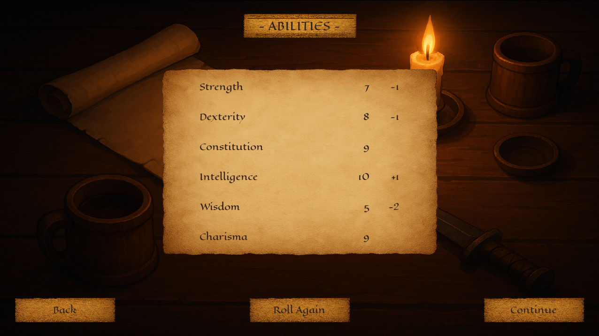

# "Basic Fantasy RPG" Character Creator 
### *"Character creation engine-lite" built for easy system swapping*

[**Last Stable Release: v1.0.0**](https://github.com/ReneGRomCodes/basic_fantasy_rpg_character_creator/releases/tag/v1.0.0)

*Current Version (in development): v1.0.1*

[Changelog](CHANGELOG.md)

## Overview

Being more than just a character creator, this application serves as a lightweight, modular engine for building RPG
character creators.
Originally developed for the Basic Fantasy RPG system, its flexible structure makes it easy to adapt to other tabletop
RPGs with minimal code changes.

Built in Python with Pygame, the application features a dynamic GUI that resizes and repositions elements based on
layout context and screen resolution. Rule systems (races, classes, attributes, etc.) can be customized via `rules.py`
and `character_model.py`, and new screens can be added while reusing existing UI logic for a consistent look and feel.

It works out of the box for Basic Fantasy RPG, but under the hood, it’s designed like a character creation engine.


## Key Features

* **Modular Rule System** – Easily adapt to other RPG systems by editing `rules.py` and `character_model.py`.

* **Adaptive, Scalable UI** – GUI elements automatically reposition and resize based on screen size and number of
elements.

* **Reusable UI Components** – Build new screens or features using shared, customizable widgets and layout tools.

* **Smart Context Handling** – UI options change based on state and context (e.g. load screen behaves differently
depending on entry point).
* **State-Driven Architecture** – Clear separation of application states ensures smooth navigation and interaction.

## Installation

### Requirements

Python 3.12

pip 25.1.1

pygame 2.6.1

pygame-textinput 1.0.1

### Installing Python packages:
`pip install -r requirements.txt`

or

`pip install pygame pygame-textinput`

### Running the Program

Clone or download the repository.

Navigate to the project directory.

Run:

`python main.py`

## Project Structure
```
project_root/
│── main.py                   # Main entry point, initializes Pygame and runs the main loop
│── core/                     # Handles game logic (settings, state management, character models, etc.)
│   ├── settings.py           # Stores configuration values (screen size, etc.)
│   ├── event_handlers.py     # Handles input events
│   ├── state_manager.py      # Manages application states
│   ├── rules.py              # Defines game mechanics and rules
│   ├── character_model.py    # Manages character attributes and interactions
│   └── items/                # Contains modules for item classes and instances (Weapons, equipment, etc.)
│       ├─ item_instances.py  # Contains item instances.
│       └─ item_objects.py    # Stores item classes.
│
│── descr/                    # Stores string-based descriptions (races, classes, etc.)
│
│── gui/                      # Manages UI components and rendering.
│   ├── screen_objects.py     # GUI element classes (buttons, text fields, etc.)
│   ├── cs_model.py           # Character sheet class and GUI logic
│   ├── ui_registry.py        # Creates and stores references to UI elements for rendering
│   ├── gui.py                # Handles UI logic and rendering functions
│   ├── ui_helpers.py         # Helper functions for positioning elements
│   ├── sl_model.py           # Save/load screen logic
│   ├── credits.py            # Credits screen logic
│   ├── settings_gui.py       # Settings screen logic
│   └── art/                  # Contains graphic assets
│
│── save/                     # Stores JSON file for saving/loading created characters.
│
└── README.md                 # You are here
```

## Screenshots

### Character Sheet


### Other Screens
#### Main Menu


#### Ability Scores


#### Race/Class Selection


#### Language Selection


#### Character Confirmation


#### Save/Load Screen


## Adding New Features

The program is designed with expandability in mind, making it easy to introduce new attributes, UI elements, or even
entirely new mechanics. Below is an example of how to add a new UI element, such as a "Luck" ability score, to the
character creation process.

Example: Adding a "Luck" Ability Score

    Modify the Character Model
        Add "luck" as a new attribute in character_model.py, ensuring it follows the same structure as other abilities.

    Update the Rules
        Modify rules.py to include "Luck" where necessary (e.g., defining how it's rolled, whether it affects class
        selection, etc.).

    Create the UI Element
        In screen_objects.py, create a new UI element class (or reuse an existing one) to display the "Luck" score.

    Add It to the GUI System
        Instantiate the "Luck" UI element in ui_registry.py, and add it to relevant functions in gui.py, ensuring it is
        included in the relevant screens.

    Adjust UI Layout
        Since the UI adapts dynamically, the new element will be positioned automatically. However, if needed,
        tweak ui_helpers.py to fine-tune spacing.

By following this process, new attributes, mechanics, or even entirely new selection screens can be integrated with
minimal effort while keeping the UI flexible and consistent.

### Adding a New GUI Element

Choose an appropriate GUI class from screen_objects.py

Instantiate the new element in ui_registry.py according to documentation within the module.

Implement the new element in the relevant modules (e.g., gui.py).

## Future Plans

* Adding export functionality for character sheets.

* Implementing an item shop UI based on existing logic.

* Refining documentation for easier customization.

## License

This repository is licensed under the MIT License. Feel free to use, modify, and distribute the code for your own
educational and non-commercial purposes.

## Credits

Created by René Grewe Romero. Feedback and contributions are welcome!

Basic Fantasy Role-Playing Game, Copyright 2006-2025 Chris Gonnerman. All Rights reserved.
Distributed under CC BY-SA license. www.basicfantasy.com